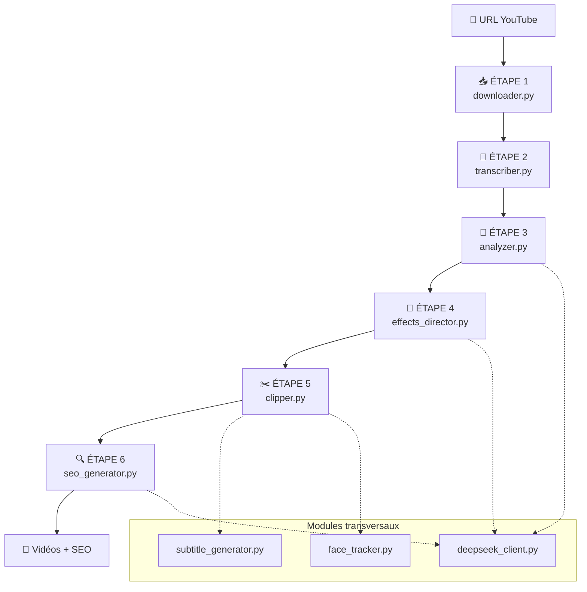
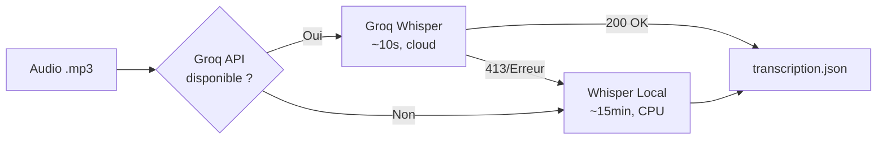
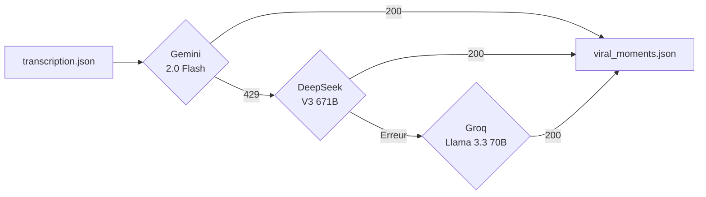
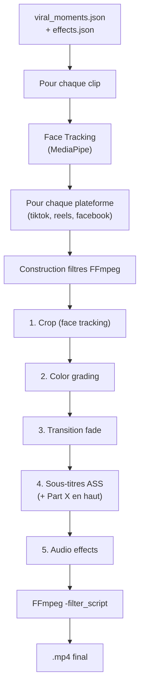
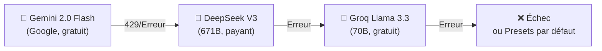
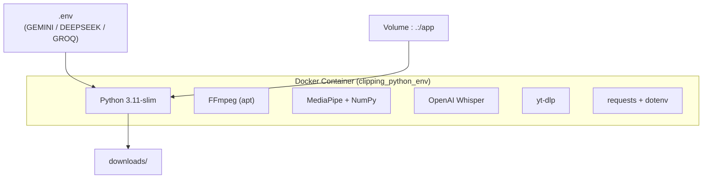
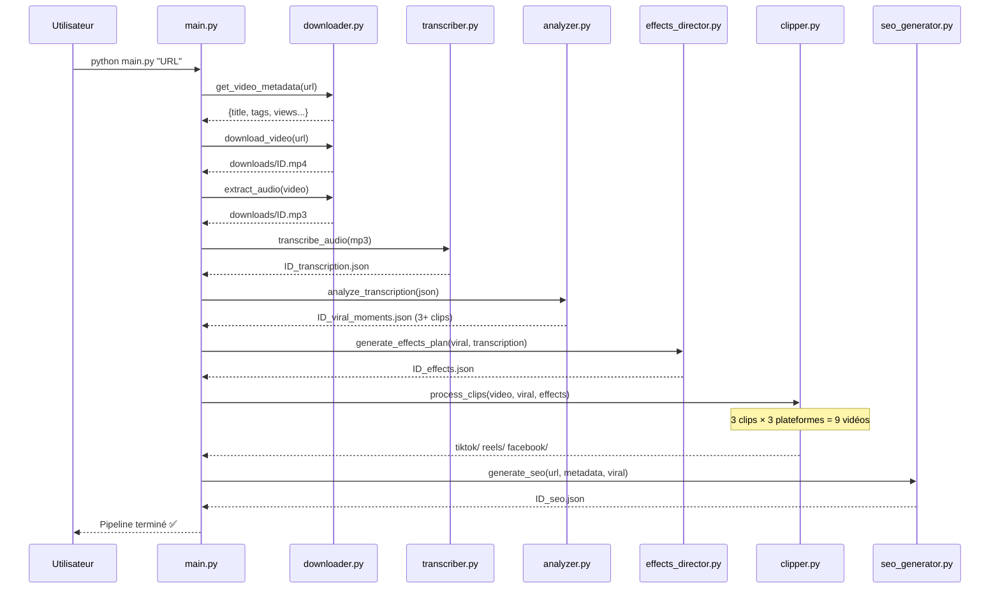

# 🏗️ Architecture Technique — Clipping Pro Pipeline

> **Version** : 2.0 — Février 2026
> **Auteur** : Projet Antigravity
> **Stack** : Python 3.11 · Docker · FFmpeg · MediaPipe · 3 APIs IA

---

## 1. Vue d'ensemble

Le système est un **pipeline séquentiel en 6 étapes** qui transforme un lien YouTube en clips vidéo verticaux prêts à publier sur TikTok, Instagram Reels et Facebook, avec sous-titres dynamiques, face tracking, color grading et descriptions SEO générées par IA.



---

## 2. Arborescence des fichiers

```
08_clipping/
├── main.py                  # Orchestrateur principal (6 étapes)
├── downloader.py            # Téléchargement YouTube + extraction audio
├── transcriber.py           # Transcription (Groq Whisper → Whisper local)
├── analyzer.py              # Détection des moments viraux (IA)
├── effects_director.py      # Sélection d'effets par plateforme (IA)
├── clipper.py               # Montage FFmpeg multi-plateforme
├── seo_generator.py         # Descriptions et hashtags (IA)
├── subtitle_generator.py    # Génération de fichiers ASS
├── face_tracker.py          # Détection de visages (MediaPipe)
├── deepseek_client.py       # Client API DeepSeek partagé
├── Dockerfile               # Image Python 3.11 + FFmpeg
├── docker-compose.yml       # Orchestration Docker
├── requirements.txt         # Dépendances Python
├── .env                     # Clés API (non versionné)
└── downloads/               # Dossier de sortie (généré)
    ├── {id}.mp4             # Vidéo source
    ├── {id}.mp3             # Audio extrait
    ├── {id}_transcription.json
    ├── {id}_viral_moments.json
    ├── {id}_effects.json
    ├── {id}_seo.json
    └── {id}_clips/
        ├── tiktok/          # 1080×1920, filtre Néon/Warm
        ├── reels/           # 1080×1920, filtre Teal&Orange/Golden
        └── facebook/        # 1080×1350, filtre Cinematic/Cool
```

---

## 3. Détail de chaque module

### 3.1 `main.py` — Orchestrateur (142 lignes)

| Fonction | Rôle |
|---|---|
| `main()` | Point d'entrée. Charge `.env`, valide les clés API, exécute les 6 étapes séquentiellement. |
| `_sanitize_video_id()` | Extrait l'identifiant YouTube du chemin fichier. |
| `_print_seo_summary()` | Affiche un résumé des descriptions SEO en console. |

**Flux de contrôle** : Chaque étape reçoit le résultat de la précédente. Si une étape critique échoue (download, transcription, analyse), le pipeline s'arrête immédiatement.

---

### 3.2 `downloader.py` — Acquisition (100 lignes)

| Fonction | Entrée | Sortie |
|---|---|---|
| `get_video_metadata(url)` | URL YouTube | `dict` (titre, tags, vues, durée…) |
| `download_video(url)` | URL YouTube | Chemin `downloads/{id}.mp4` |
| `extract_audio(video_path)` | Chemin `.mp4` | Chemin `downloads/{id}.mp3` |

**Dépendances** : `yt-dlp` (téléchargement), `ffmpeg` (extraction audio mono 48kbps).

**Optimisation audio** : L'audio est compressé en mono 48kbps pour rester sous la limite de 25 Mo de Groq Whisper.

---

### 3.3 `transcriber.py` — Transcription (128 lignes)



| Fonction | Modèle IA | Latence |
|---|---|---|
| `_transcribe_groq()` | `whisper-large-v3` | ~10 secondes |
| `_transcribe_local()` | `whisper-base` | ~15 minutes (CPU) |

**Format de sortie** (`_transcription.json`) :
```json
{
  "language": "fr",
  "text": "Texte complet...",
  "segments": [
    {"id": 0, "start": 0.0, "end": 3.5, "text": "Bonjour à tous"}
  ]
}
```

---

### 3.4 `analyzer.py` — Détection virale (228 lignes)



| Fonction | Rôle |
|---|---|
| `analyze_transcription()` | Orchestrateur avec fallback Gemini → DeepSeek → Groq |
| `_build_prompt()` | Construit le prompt IA (segments tronqués intelligemment) |
| `_analyze_gemini()` | Appel REST Gemini 2.0 Flash |
| `_analyze_groq()` | Appel REST Groq Llama 3.3 70B |
| `_parse_ai_response()` | Nettoyage JSON (suppression markdown) |
| `_save_result()` | Écriture du fichier de sortie |

**Contraintes du prompt** :
- **Minimum 3 clips** chronologiques
- **Durée ≥ 30 secondes** par clip
- **Nomenclature obligatoire** : `"Part 1 - [Titre]"`, `"Part 2 - [Titre]"`…
- Les bornes `start`/`end` doivent correspondre à des limites de segments

**Format de sortie** (`_viral_moments.json`) :
```json
{
  "clips": [
    {
      "clip_index": 1,
      "title": "Part 1 - Le début de l'histoire",
      "start": 12.5, "end": 45.2,
      "viral_score": 9,
      "suggested_caption": "Accroche..."
    }
  ]
}
```

---

### 3.5 `effects_director.py` — Direction artistique IA (364 lignes)

**Catalogues intégrés :**

| Type | Clé | Description |
|---|---|---|
| 🎨 Couleur | `vibrant_warm` | Saturation 1.4, tons chauds |
| 🎨 Couleur | `vibrant_cool` | Tons froids bleutés |
| 🎨 Couleur | `vibrant_golden` | Heure dorée |
| 🎨 Couleur | `vibrant_teal_orange` | Cinématique Teal & Orange |
| 🎨 Couleur | `vibrant_neon` | Saturé, contrasté, nuit |
| 🎨 Couleur | `vibrant_cinematic` | Sombre, posé, cinéma |
| 🔊 Audio | `bass_boost` | Low-shelf boost 6dB |
| 🔊 Audio | `audio_normalize` | Loudnorm -14 LUFS |
| 🎥 Visuel | `zoom_pulse` | Zoom lent pulsé |
| 🎥 Visuel | `sharp` | Netteté accrue |

**Presets par défaut (si l'IA échoue)** :

| Plateforme | Effets | Couleur | Transition |
|---|---|---|---|
| TikTok | bass_boost, sharp | vibrant_neon | none |
| Reels | audio_normalize | vibrant_teal_orange | none |
| Facebook | audio_normalize | vibrant_cinematic | fade |

| Fonction | Rôle |
|---|---|
| `generate_effects_plan()` | Orchestrateur IA (Gemini → DeepSeek → Groq → Presets) |
| `get_color_filter_vf()` | Traduit un filtre couleur en expression FFmpeg `-vf` |
| `get_ffmpeg_filters()` | Traduit les effets en filtres FFmpeg `-vf` et `-af` |
| `get_output_dimensions()` | Retourne `(width, height)` par plateforme |
| `_build_effects_prompt()` | Prompt IA pour le choix des effets |
| `_generate_default_plan()` | Plan de secours sans IA |
| `_validate_and_enrich()` | Vérifie et complète le plan IA |

---

### 3.6 `clipper.py` — Montage FFmpeg (221 lignes)



| Fonction | Rôle |
|---|---|
| `process_clips()` | Boucle principale : pour chaque clip × plateforme |
| `_render_clip()` | Construit la chaîne de filtres FFmpeg et encode |
| `_build_crop_filter()` | Génère le crop dynamique basé sur les coordonnées du visage |
| `_safe_filename()` | Nettoie les titres pour les noms de fichiers |

**Chaîne de filtres vidéo FFmpeg (dans l'ordre)** :
1. `crop` — Recadrage vertical centré sur le visage (ou centré par défaut)
2. `eq`+`colorbalance` — Color grading vibrant (différent par plateforme)
3. `fade` — Transition d'entrée/sortie (optionnel, Facebook)
4. `ass` — Sous-titres dynamiques + titre "PART X" permanent en haut

**Nommage des fichiers de sortie** :
```
{clip_index}_{Part_X_-_Titre_nettoyé}.mp4
```

---

### 3.7 `subtitle_generator.py` — Sous-titres (105 lignes)

Génère des fichiers **ASS (Advanced SubStation Alpha)** avec 2 styles :

| Style | Position | Couleur | Usage |
|---|---|---|---|
| `Default` | Bas (Alignment 2, MarginV 450) | Jaune `&H0000FFFF` | Paroles découpées 3 mots |
| `Title` | Haut (Alignment 8, MarginV 150) | Blanc `&H00FFFFFF` | "PART 1", "PART 2"… |

| Fonction | Rôle |
|---|---|
| `generate_ass_for_clip()` | Génère le fichier ASS complet pour un clip |
| `split_text_into_chunks()` | Découpe le texte en blocs de 3 mots max |
| `format_time_ass()` | Convertit secondes → `H:MM:SS.cs` |

**Logique de découpage** : Chaque segment de transcription est découpé en sous-blocs de 3 mots, affichés séquentiellement. Le texte est en majuscules pour maximiser la lisibilité.

---

### 3.8 `face_tracker.py` — Suivi de visage (143 lignes)

| Classe/Fonction | Rôle |
|---|---|
| `FaceTracker.__init__()` | Initialise MediaPipe Face Detection |
| `FaceTracker.get_tracking_data()` | Analyse la vidéo et retourne les coordonnées X lissées |
| `FaceTracker._smooth_coordinates()` | Moyenne mobile (window=15) anti-saccades |

**Pipeline de tracking** :
1. FFmpeg extrait les frames brutes (640px de large) via pipe
2. MediaPipe détecte le visage principal (1 frame / 5)
3. Les coordonnées X du centre du visage sont lissées (moyenne mobile window=15)
4. Décimation à 1 point / 0.8 seconde pour limiter la taille de l'expression FFmpeg

---

### 3.9 `deepseek_client.py` — Client API partagé (75 lignes)

| Fonction | Rôle |
|---|---|
| `call_deepseek()` | Appel brut → texte |
| `call_deepseek_json()` | Appel + parsing JSON automatique |

**Endpoint** : `https://api.deepseek.com/chat/completions` (compatible OpenAI)
**Modèle** : `deepseek-chat` (DeepSeek-V3, 671B paramètres)
**Timeout** : 120 secondes

---

## 4. Système de fallback IA

Toutes les étapes IA utilisent la même chaîne de priorité :



| Module | Gemini | DeepSeek | Groq | Dernier recours |
|---|---|---|---|---|
| `analyzer.py` | ✅ Priorité | ✅ Fallback 1 | ✅ Fallback 2 | Pipeline s'arrête |
| `effects_director.py` | ✅ Priorité | ✅ Fallback 1 | ✅ Fallback 2 | Presets par défaut |
| `seo_generator.py` | ✅ Priorité | ✅ Fallback 1 | ✅ Fallback 2 | Pas de SEO |
| `transcriber.py` | — | — | ✅ Whisper cloud | Whisper local (CPU) |

---

## 5. Infrastructure Docker



| Composant | Version | Rôle |
|---|---|---|
| Base image | `python:3.11-slim` | Runtime Python léger |
| FFmpeg | apt package | Encodage vidéo/audio |
| yt-dlp | latest | Téléchargement YouTube |
| MediaPipe | ≥ 0.10.13 | Détection de visages |
| OpenAI Whisper | latest | Transcription locale (fallback) |
| requests | 2.31.0 | Appels HTTP aux APIs IA |
| python-dotenv | 1.0.1 | Chargement des variables d'environnement |

---

## 6. Flux de données complet



---

## 7. Variables d'environnement

| Variable | Obligatoire | Usage |
|---|---|---|
| `GEMINI_API_KEY` | Recommandé | Moteur IA prioritaire (analyse, effets, SEO) |
| `DEEPSEEK_API_KEY` | Optionnel | Fallback 1 si Gemini échoue |
| `GROQ_API_KEY` | Recommandé | Transcription Whisper cloud + fallback 2 IA |
| `TELEGRAM_BOT_TOKEN` | Non utilisé | Réservé pour future intégration bot |

**Règle** : Au moins 1 clé parmi `GEMINI` / `DEEPSEEK` / `GROQ` est requise.

---

## 8. Commandes d'exploitation

```bash
# Construire et démarrer l'environnement
docker compose up -d --build

# Lancer le pipeline sur une vidéo
docker compose exec clipping-env python main.py "URL_YOUTUBE"

# Voir les logs en temps réel
docker compose logs -f clipping-env

# Arrêter l'environnement
docker compose down
```
