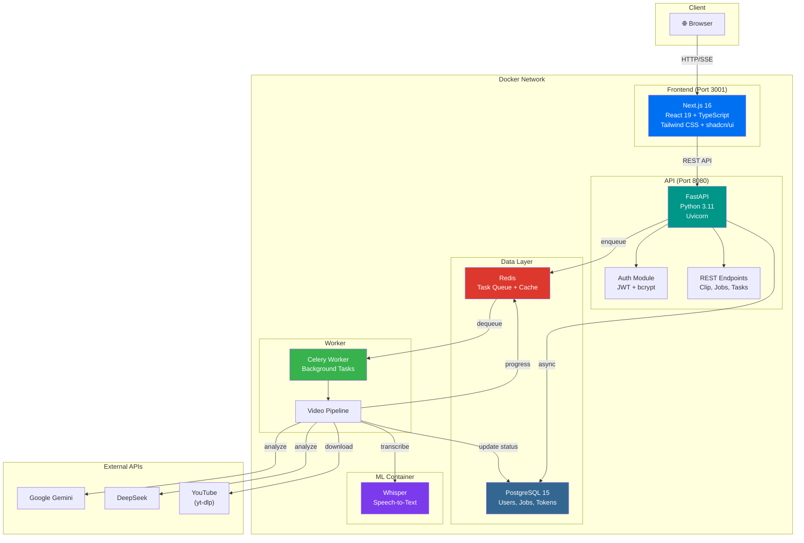
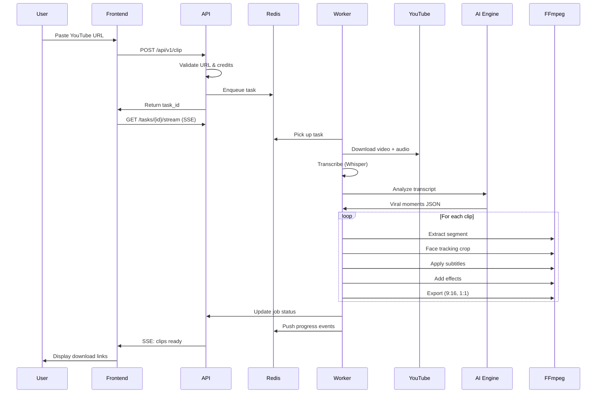
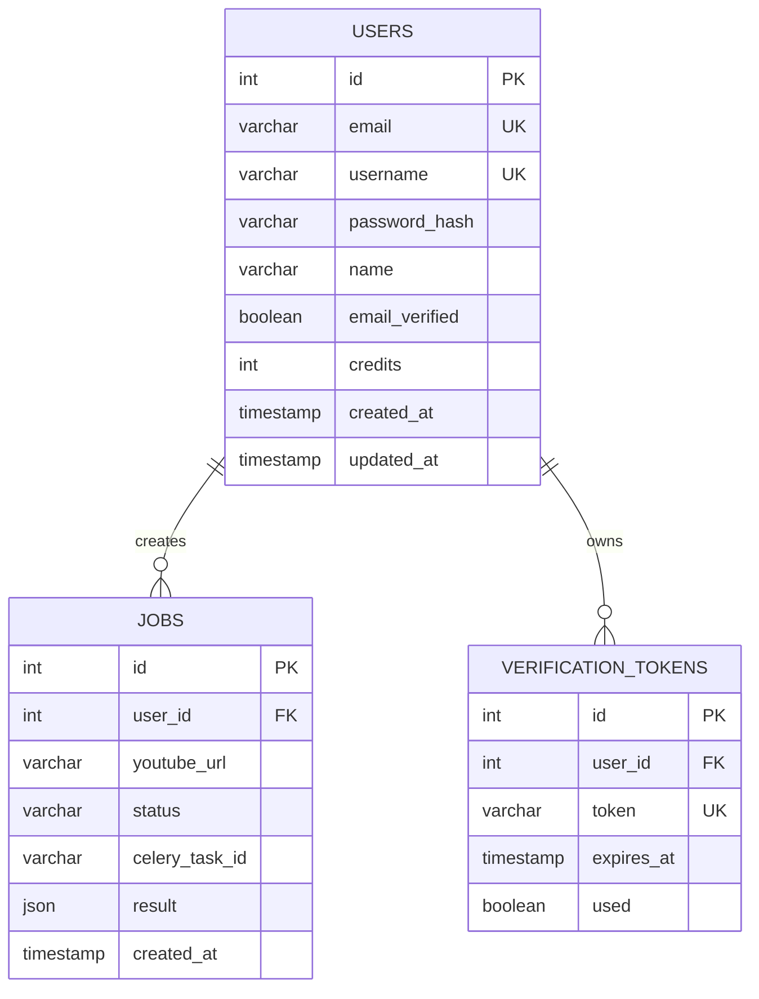
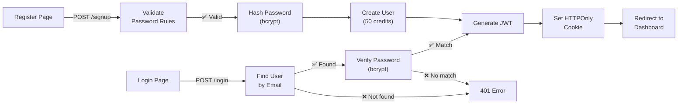
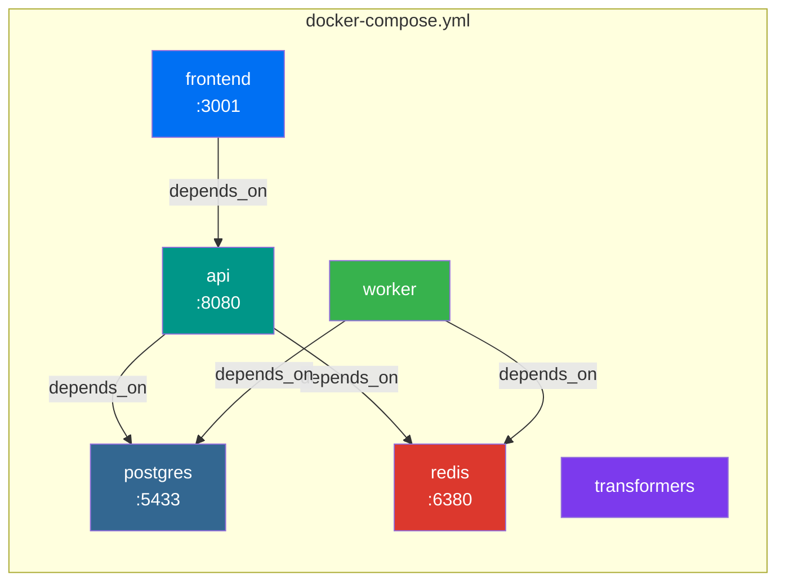
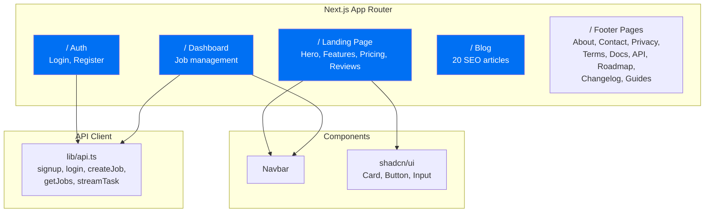

# �️ Architecture — AutoClip AI

## Overview

AutoClip AI is a full-stack SaaS platform built with a microservices architecture. The system is fully containerized with Docker Compose (6 services) and uses asynchronous processing for video tasks.

---

## System Architecture

---

## Video Processing Pipeline

---

## Database Schema

---

## Authentication Flow

### Password Requirements
- Minimum 8 characters
- At least 1 uppercase letter (A-Z)
- At least 1 lowercase letter (a-z)
- At least 1 digit (0-9)
- At least 1 special character (!@#$%^&*)

---

## Docker Services

| Service | Image | Port | Purpose |
|---------|-------|------|---------|
| `frontend` | Node 20 + Next.js 16 | 3001 → 3000 | Web application |
| `api` | Python 3.11 + FastAPI | 8080 → 8000 | REST API server |
| `worker` | Python 3.11 + Celery | — | Background processing |
| `postgres` | PostgreSQL 15 | 5433 → 5432 | Persistent storage |
| `redis` | Redis 7 Alpine | 6380 → 6379 | Task queue & cache |
| `transformers` | Python 3.11 | — | ML models (Whisper) |

---

## Frontend Architecture

---

## Key Design Decisions

| Decision | Rationale |
|----------|-----------|
| **Celery for video tasks** | Video processing is CPU-intensive (5-10 min); async processing avoids blocking API |
| **SSE for progress** | Server-Sent Events provide real-time updates without WebSocket complexity |
| **bcrypt for passwords** | Industry standard, resistant to brute-force and rainbow table attacks |
| **Multiple AI engines** | Gemini, DeepSeek, Groq offer different analysis quality; user can choose |
| **Docker Compose** | Single-command deployment, consistent environments, easy scaling |
| **Next.js App Router** | File-based routing, server components, SEO metadata generation |
| **PostgreSQL async** | asyncpg provides non-blocking DB access matching FastAPI's async nature |
